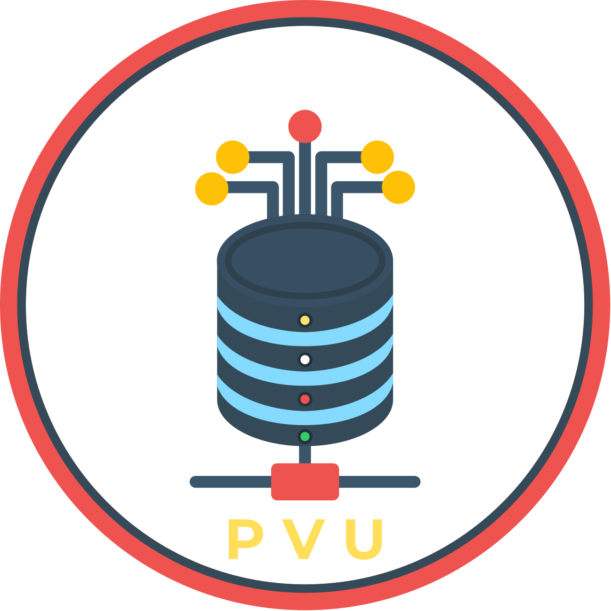

<h2 align="center">
  <p align="center"></p>
</h2>

<p align="center">
  <a href="#usage">Usage</a> •
  <a href="#tui-controls">TUI controls</a> •
  <a href="#installation">Installation</a>
</p>

# Pod Volums (pvu)

`pvu` is a kubectl plugin for inspecting pod volumes.

It can run in two modes:
- interactive TUI mode for browsing pods in a namespace
- direct CLI mode for printing volume details for a specific pod


## Usage


Without arguments, `pvu` starts the interactive TUI:

```bash
kubectl pvu
```

To inspect a specific pod directly:

```bash
kubectl pvu POD_NAME
```

To target a specific namespace:

```bash
kubectl pvu -n kube-system
kubectl pvu POD_NAME -n kube-system
```
Show version information:

```bash
kubectl pvu --version
```

Show help:

```bash
kubectl pvu --help
```

## Behavior

`pvu` uses the current Kubernetes context unless a namespace or kubeconfig file is provided explicitly.

When no pod name is given, the command opens the interactive TUI. When a pod name is given, it prints the pod volume view directly.

## TUI controls

In the pod list view:

- `/` starts filtering
- `↑` / `k` moves up
- `↓` / `j` moves down
- `enter` opens the selected pod
- `q` or `ctrl+c` quits

In the detail view:

- `b` or `esc` goes back
- `q` or `ctrl+c` quits

## Installation

### Install manually as a kubectl plugin

Place the binary somewhere on your `PATH` with the name `kubectl-pvu`.

Example:

```bash
sudo install -m 0755 kubectl-pvu /usr/local/bin/kubectl-pvu
```

Then run:

```bash
kubectl pvu --help
```

### Install with Krew

Install `pvu` from your Krew index

```bash
kubectl krew install pvu
```

After install:

```bash
kubectl pvu --help
kubectl pvu --version
```

To remove it:

```bash
kubectl krew uninstall pvu
```
